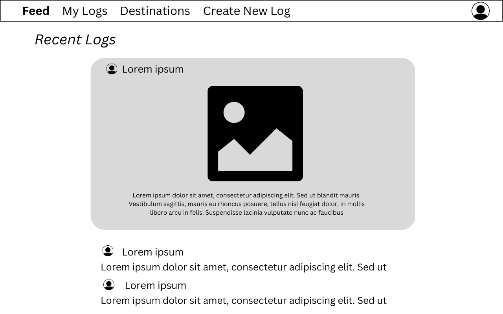

# Flutter-app 🦋

Be the social butterfly of travel! ✈️

---

## Wireframes

---

## ERD

## User Stories

- As a user I want to be able to login, so that I can access my profile
- As a user I want to be able to sign up, so that I can start using the travel app
- As a user I want to be able to view the feed, so that I can see all most recent travel logs, including mine and other people's
- As a user I want to be able to add a travel log, so that I can view it in my Logs and feed
- As a user I want to be able to edit a travel log, so I can keep it up to date
- As a user I want to be able to delete a travel log, so I can keep my Logs up to date
- As a user I want to be able to view all travel logs, so I see all my travel history
- As a user I want to be able to edit my profile, so I can keep it up to date
- As a user I want to be able to delete my profile, so I can remove my profile from this app
- As a user I want to be able to navigate to each page, so that I can go to and use any page
- As a user I want to be able to add comments under any log, so I can interact with other users via comments
- As a user I want to be able to delete my comments, so I can remove it from the comments section

## TO DOs

- Add nav bar, that is present everywhere and takes user to necessary pages - feed (all logs), my logs (his logs), etc
- User is able to add / delete / edit and view his logs on his MY LOGS page -> add this functionality
- Add same functionality to each destination page option (city/ lake/ mountain/ beach)
- Add option to delete user profile -> for 2nd model crud add / delete
- Add comments CRUD
- ADD link_to & redirects on all pages
- Think some more on how to go about the category page - when is it logical for it popup --> maybe add functionality - view only mine, view all

- of course add styling

## AS OF NOW

- User must login
- After login, he is prompted to feed page with most recent logs of all users
- Can go to my_logs, and access only his logs
- Can go to destination page to view all categories
- As user clicks on any of the categories, redirected to page with his logs on that category
- Once User creates new travel log, he is redirected to all his travel logs, in desc order
- Current User can edit his own logs ONLY

current crud

- user can add new travel log, related to this specific user
- user can edit his travel log
- user can see all his travel logs / all travel logs
