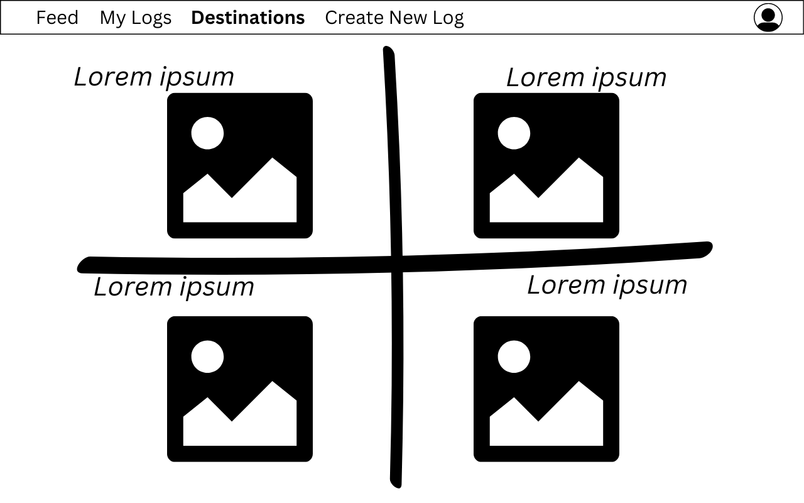

# Flutter-app 🦋

Be the social butterfly of travel! ✈️

---

## 🤔 About

Flutter 🦋 is a Travel Log web application that allows users to create and share their travel logs and interact with other users via comments on travel logs. This is a solo full stack project built using Rails over a period of 7 days.

---

## 💻 Technologies Used

- Ruby 3.2.1
- Rails 7.0.4
- Postgresql, for the database
- Puma as the web server
- Turbo-Rails for Hotwire's SPA-like page accelerator
- Stimulus-Rails for Hotwire's modest JavaScript framework
- Devise for authentication
- Bootstrap 5.2.3 for styling
- Heroku for deployment

---

## 👾 Link

Deployed version here:

---

## 👀 Wireframes





---

## 👉 ERD


## 🧐 Planning

- Day 1: I started the process by first sketching out the models, their attributes and relationships between each other. Then moved on to the wireframes and user stories.
- Day 2: First thing I did was the authentication using Devise. Then moved on to building out the backend by establishing all the models. Also seeded some data data in and tested my models and their relations in my rails console.
- Day 3-5: Starting building my frontend using controller / views in Rails. Also added the NavBar and did the routing.
- Day 6-7: Added a comment model, set the relations for it and started building the methods and views for it. Additionally, made major styling adjustments using Bootstrap and CSS. Also started the deployment process using Heroku.

---

## 👩‍💻 Featured Code

- Add functionality to the comments section
- Improve the styling and layout of the comments section
- Create a user profile path where user can edit their information & delete profile
- Add Maps API to show geographical locations of the travels

---

## 👩‍💻 Featured Code

```
class TravelLogsController < ApplicationController
  before_action :authenticate_user!
  before_action :set_travel_log, only: [:edit, :destroy]
  # authenticate user before using the website

```

- Before any action on the website, user has to either create a new account or login to an existing account.

```
  def index
    @travel_logs = TravelLog.order(created_at: :desc).limit(10)
  end

  def show
  @travel_log = TravelLog.find(params[:id])
  @comments = @travel_log.comments
  @comment = Comment.new
  @current_user = current_user
  end

  def my_logs
    @travel_logs = current_user.travel_logs.order(created_at: :desc)
  end

```

- Through the index action, a user is able to view all most recent travel logs.
- A user can also go to a specific travel log and leave comments underneath, by which a user is able to engage with other users on the platform.
- A user can also go and view only his / her logs and perform actions like edit or delete their travel log.

```
 <% if travel_log.user == current_user %>
          <%= link_to "Edit Travel Log", edit_travel_log_path(travel_log), class: "btn btn-primary" %>
           <%= link_to "Delete Travel Log", travel_log_path(travel_log), data: { turbo_method: :delete, turbo_confirm: "Are you sure you want to delete this travel log?" }, class: "btn btn-danger" %>
        <% end %>
```

- A user is only allowed to edit or delete his / her own travel logs on main page ☝️. This is done by checking if current logged in user is same as the user that created this travel log:

```
if travel_log.user == current_user
```

---

## ✅ User Stories

- As a user I want to be able to login, so that I can access my profile
- As a user I want to be able to sign up, so that I can start using the travel app
- As a user I want to be able to view the feed, so that I can see all most recent travel logs, including mine and other people's
- As a user I want to be able to add a travel log, so that I can view it in my logs and feed
- As a user I want to be able to edit a travel log, so I can keep it up to date
- As a user I want to be able to delete a travel log, so I can keep my logs up to date
- As a user I want to be able to view all travel logs, so I see all my travel history
- As a user I want to be able to delete my profile, so I can remove my profile from this app
- As a user I want to be able to navigate to each page, so that I can go to and use any page
- As a user I want to be able to add comments under any log, so I can interact with other users via comments
- As a user I want to be able to delete my comments, so I can remove it from the comments section
- As a user I want to be able to click on the destination link (beach, lake, city or mountain), and get redirected to the page with all associated travel logs, so that I can view all associated travel logs

---

## 🐞 Bugs

- The comment edit section is not workable at the moment

---
